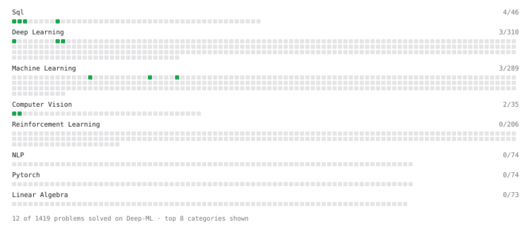

# Deep-ML

My machine learning practice from [Deep-ML](https://www.deep-ml.com). Every solution here was written by hand.

**2** solved · 2 problems · 0 labs · 0 math

[**Browse the interactive portfolio**](https://anhour-xyz.github.io/deep-ml/) to replay this filling in over time.

## Problems

| | Difficulty | Solved | |
| --- | --- | --- | --- |
| [Calculate Accuracy Score](https://www.deep-ml.com/problems/36) | easy | 2026-09-17 | [solution](problems/0036-calculate-accuracy-score) |
| [Sigmoid Activation Function Understanding](https://www.deep-ml.com/problems/22) | easy | 2026-09-17 | [solution](problems/0022-sigmoid-activation-function-understanding) |

---

_This file is regenerated by Deep-ML on every push._
